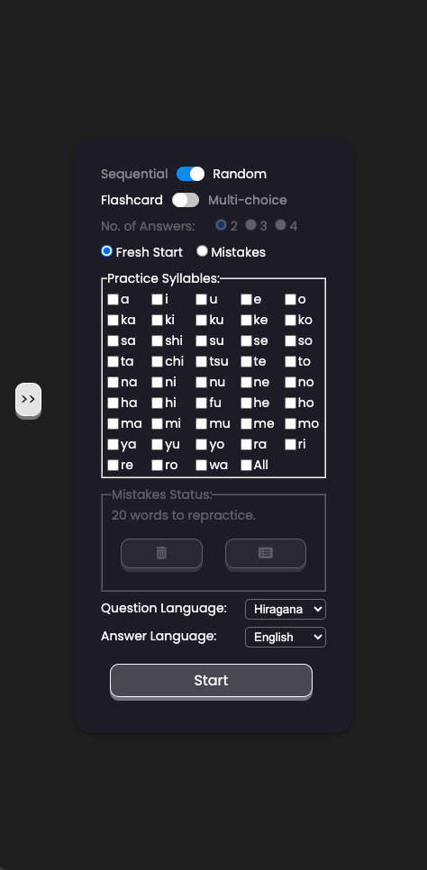
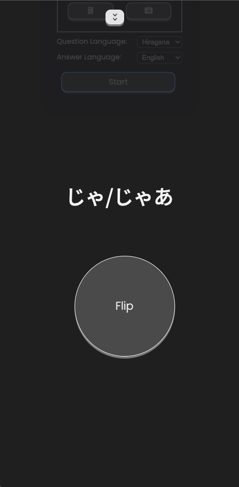
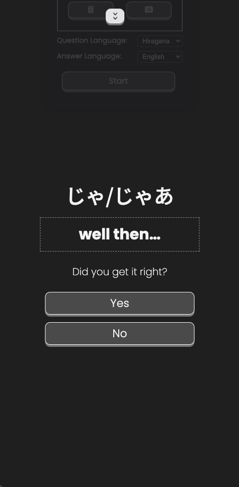
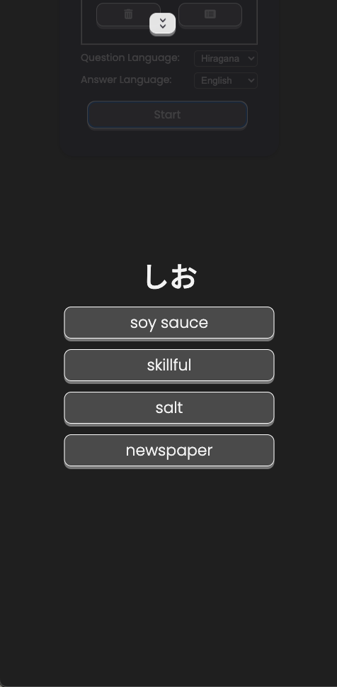
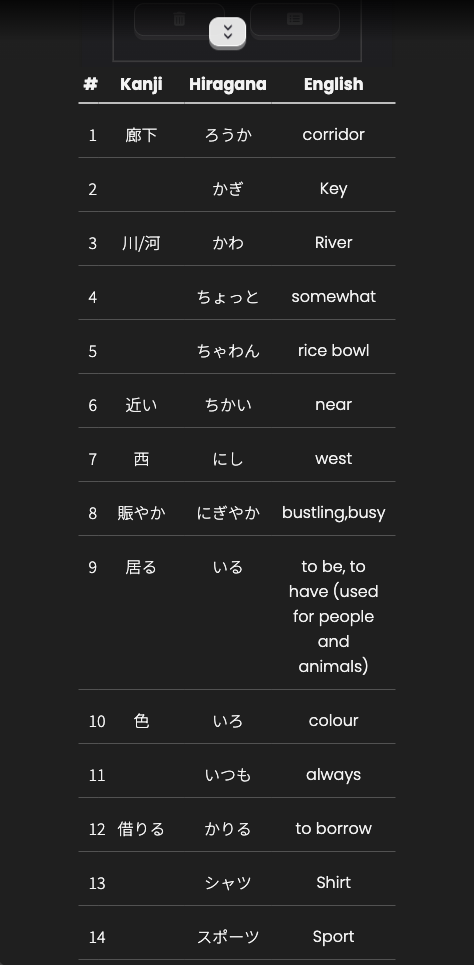

# Vocabulary Quiz Project

This repository contains a vocabulary quiz application built with JavaScript, designed specifically for Japanese language learning. The project allows users to practice and enhance their vocabulary skills by dynamically generating questions and managing answer choices.

---

## Table of Contents

- [Features](#features)
- [Getting Started](#getting-started)
- [Usage](#usage)
- [File Structure](#file-structure)
- [Contributing](#contributing)
- [License](#license)
- [Screenshots](#screenshots)
- [Demo](#demo)
- [Acknowledgements](#acknowledgements)

---

## Features

- **Dynamic Question Generation**: Questions are generated dynamically based on user inputs or stored data.
- **Answer Validation**: Ensures that selected answers are unique and valid.
- **Error Handling**: Robust mechanisms to catch and handle runtime errors, such as infinite loops or insufficient data.
- **Mistake Tracking**: Stores incorrect answers in local storage for future practice.
- **Syllable Validation**: Includes a validation step to ensure proper syllable data before quiz generation.
- **Modes of Operation**: Supports both `fresh` and `stored` quiz modes.

---

## Getting Started

### Prerequisites

Ensure you have the following installed on your machine:

- A modern web browser (e.g., Chrome, Firefox)
- A text editor or IDE (e.g., Visual Studio Code)

### Installation

1. Clone this repository:

   ```bash
   git clone https://github.com/MgHt00/JLPT.git
   ```

2. Open `index.html` in your browser to run the application locally.

---

## Usage

1. Launch the application by opening `index.html` in a web browser.
2. Select the desired quiz mode (`fresh` or `stored`).
3. Input the necessary settings, such as the number of answers and syllables.
4. Start the quiz and answer the questions.
5. View your results and track mistakes for future practice.

---

## File Structure

```
/JLPT
|-- /assets
|   |-- data          # JSON, and raw CSV files
|-- /docs
|   |-- l-n           # Logic explanations, and notes
|-- /src
|   |-- /css          
|   |   |-- base.css    
|   |   |-- dynamic-classes.css     
|   |   |-- fonts.css
|   |   |-- index.css
|   |   |-- ui.css
|   |-- /js
|   |   |-- /components
|   |   |   |-- answerListenerManager.js 
|   |   |   |-- answerManager.js
|   |   |   |-- componentsManager.js
|   |   |   |-- controlManager.js
|   |   |   |-- errorManager.js
|   |   |   |-- listenerManager.js
|   |   |   |-- loaderManager.js
|   |   |   |-- questionManager.js
|   |   |   |-- satusManager.js
|   |   |   |-- vocabManager.js
|   |   |-- /services
|   |   |   |-- globals.js
|   |   |   |-- selectors.js
|   |   |-- /utils
|   |   |   |-- displayUtils.js
|   |   |   |-- domUtils.js
|   |   |   |-- hlepers.js
|   |   |   |-- utilsManager.js
|   |   |-- index.js
|-- index.html        # Main HTML file
|-- README.md         
```

## Contributing

Contributions are welcome! If you'd like to contribute to this project, please fork the repository and submit a pull request.

Here is a license you can include in your project, which gives you credit if others use your code:

## License

MIT License

Copyright (c) 2025 Win Htoo Shwe

Permission is hereby granted, free of charge, to any person obtaining a copy of this software and associated documentation files (the "Software"), to deal in the Software without restriction, including without limitation the rights to use, copy, modify, merge, publish, distribute, sublicense, and/or sell copies of the Software, subject to the following conditions:

1. **Credit:** You must give appropriate credit, provide a link to the license, and indicate if changes were made. You may do so in any reasonable manner, but not in any way that suggests the licensor endorses you or your use.
   
2. The above copyright notice and this permission notice shall be included in all copies or substantial portions of the Software.

THE SOFTWARE IS PROVIDED "AS IS", WITHOUT WARRANTY OF ANY KIND, EXPRESS OR IMPLIED, INCLUDING BUT NOT LIMITED TO THE WARRANTIES OF MERCHANTABILITY, FITNESS FOR A PARTICULAR PURPOSE, AND NONINFRINGEMENT. IN NO EVENT SHALL THE AUTHORS OR COPYRIGHT HOLDERS BE LIABLE FOR ANY CLAIM, DAMAGES, OR OTHER LIABILITY, WHETHER IN AN ACTION OF CONTRACT, TORT OR OTHERWISE, ARISING FROM, OUT OF OR IN CONNECTION WITH THE SOFTWARE OR THE USE OR OTHER DEALINGS IN THE SOFTWARE.

## Screenshots

Here are some screenshots:

### Main Screen


### Flashcard Mode




### Multiple Choice Mode


### Listing Previous Mistakes


## Demo

https://mght00.github.io/JLPT/

## Acknowledgements

A huge shoutout to [ChatGPT](https://www.openai.com/) for being an invaluable partner in logic building, debugging, and brainstorming sessions throughout the development of this project. From tackling tricky code issues to refining functionality, ChatGPT was there every step of the way, ensuring the code not only worked but worked well!